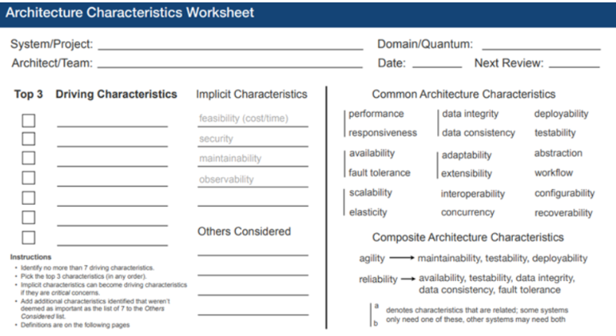

# OpenMarket-Corp.-E-Market1.

# 1. Identify Architecture Characteristics

## TOP 3 Driving Characteristics

### Elasticity
**Justification:**  
Related to Requirement 3.1. Essential for supporting massive traffic spikes without impacting the user experience.

### Availability
**Justification:**  
Related to Requirement 3.3. Critical for preventing prolonged downtime during peak sales seasons.

### Security
**Justification:**  
Related to Requirement 3.4. Requires the protection of financial and personal data, strictly complying with the PCI-DSS standard.

---

## Other Driving Characteristics Considered

### Interoperability
**Justification:**  
Related to Requirements 1.1, 1.4, and 2.4. Necessary for integrating suppliers via CSV/REST, payment gateways, and shipping carriers.

### Extensibility
**Justification:**  
Requirement 4.4 anticipates the addition of new features (e.g., subscriptions, loyalty programs) without fundamentally altering the base system.

### Responsiveness
**Justification:**  
Requirement 2.1 demands an agile UI where the customer does not experience excessive delays when browsing or filtering.

### Data Consistency
**Justification:**  
Requirements 1.5 and 2.5 mandate accurate inventory tracking and require immediate stock confirmation upon a sale.

## Other Considered

| Name | Text |
|-----|------|
| Name | Text |
| Name | Text |

## Implicit Characteristics

*(Implicit characteristics are those that the client does not usually explicitly request in a document because they "assume" any professional software has them, but as architects, we must take them into account).*

### Maintainability
With multiple developers and new features planned for the future, the code must be clean, modular, and easy to maintain. It must be properly documented.

### Deployability
Given the "frequent updates" and "multiple suppliers", the system must be able to be updated and integrated continuously (CI/CD) without taking the store offline. Best practices must be followed.

### Testability
When handling third-party payments and complex inventories, critical components must be easily subjected to automated testing. There must be unit tests covering edge cases, integration tests (to isolate communication with gateways and carriers), and E2E tests (to validate the entire checkout flow).

# 2. Select the Architectural Style

**Responsible:** Alejandro  

Your task is to choose the macro-structure of the system based on the characteristics selected by Román.

## Specific Tasks
- Complete the **Architecture Styles Worksheet** comparing styles (Monolith vs Microservices vs Event-Driven).
- Write **ADR-002-estilo-arq.md**, arguing the final choice and acknowledging the accepted trade-offs.

## Architecture Styles Worksheet

To determine the most appropriate architectural structure for OpenMarket Corp E-Market, three architectural styles were evaluated based on the previously identified driving characteristics: **Elasticity, Availability, and Security**.

| Architectural Style | Advantages | Disadvantages | Alignment with Driving Characteristics |
|--------------------|------------|---------------|----------------------------------------|
| Monolithic Architecture | Simple development and deployment, easier initial setup. | Limited scalability, high coupling, risky deployments affecting the entire system. | Poor alignment with Elasticity and Availability requirements. |
| Microservices Architecture | Independent scalability, fault isolation, continuous deployment capability, service autonomy. | Increased operational complexity and infrastructure management. | Strong alignment with Elasticity, Availability, and Security. |
| Event-Driven Architecture | Loose coupling, asynchronous communication, high responsiveness. | Complex debugging and data consistency challenges. | Good alignment with Extensibility and Responsiveness but higher implementation complexity. |

## Architectural Style Selection

**Selected approach:**  
**Microservices Architecture complemented with Event-Driven communication**

### Justification

The OpenMarket platform must support large traffic spikes, multiple external integrations, and continuous evolution of features without impacting system stability.

A microservices architecture enables:

- Independent horizontal scaling of services (**Elasticity**).
- Failure isolation to maintain system operation (**Availability**).
- Separation of sensitive domains such as authentication and payments (**Security**).
- Independent deployment cycles supporting CI/CD pipelines (**Deployability**).

Event-driven communication will be used as a complementary approach for asynchronous processes such as notifications, inventory updates, and post-payment operations.

## ADR-002 — Architecture Decision Record

**ADR ID:** ADR-002  
**Title:** Selection of Architectural Style for OpenMarket Corp E-Market  
**Date:** 2025  
**Status:** Accepted  
**Deciders:** Alejandro Gonzales Jesus (Section E - Capstone Team)

### Context
OpenMarket Corp requires a scalable, highly available, and secure e-commerce platform capable of handling significant traffic spikes, supporting multiple third-party integrations, and evolving continuously with new features.

### Decision
We will adopt a **Microservices Architecture** as the primary structural style, complemented by **Event-Driven communication** for asynchronous workflows. Each business domain will be encapsulated in an independent, deployable service with its own data store (Database-per-Service pattern).

### Consequences

#### Positive Outcomes
- Independent service scaling supporting Elasticity (Req 3.1).
- Failure isolation supporting Availability (Req 3.3).
- Isolation of sensitive domains supporting Security/PCI-DSS (Req 3.4).
- Independent deployments enabling CI/CD.

#### Trade-offs Accepted

| Trade-off | Rationale |
|---------|-----------|
| Increased operational complexity | Required for independent scaling and fault isolation. |
| Distributed tracing and debugging challenges | Mitigated with observability tools (e.g., Jaeger, ELK Stack). |
| Higher infrastructure cost | Offset by cloud auto-scaling and pay-per-use models. |

### Alternatives Rejected
- **Monolithic Architecture:** Poor alignment with Elasticity and Availability.
- **Pure Event-Driven Architecture:** Data consistency and debugging complexity issues.
- **Microkernel Architecture:** Explicitly excluded due to scalability constraints.

# 3. Architectural Representation (C4 Model)

## C1 – Technical Annotations
- Customer/Admin to System: HTTPS communication, JSON/HTML formats.
- System to Payment Gateway: Synchronous REST integration (e.g., Stripe/PayPal).
- System to Provider Systems: SFTP for batch CSV and REST for real-time updates.

## C2 – Technical Annotations
- **Identity Provider (Keycloak):** Centralizes security, OIDC, JWT tokens.
- **Cache Server (Redis):** Improves responsiveness by caching data.
- **Search Engine (ElasticSearch):** Enables advanced filtering and text search.
- **Database per Service:** Ensures data isolation and consistency.

## C3 – Technical Annotations (Payment Service)
- Circuit Breaker Component (Resilience4j).
- Fraud Detection Engine.
- Event Outbox Component.
- Auth Guard.

# 4. Code Repository

**Weblink:**  
http://www.example.com/

---

# 5. Class Diagrams

The Payment Service component is used as the central orchestrator.

| Class / Interface | Basic Functions | Responsibility |
|------------------|-----------------|----------------|
| PaymentOrchestrator | processPayment(), handleResult() | Coordinates payment flow |
| IFraudEngine | checkRisk() | Fraud validation |
| ICircuitBreaker | executeSafeCall() | External failure resilience |
| ITransactionRepo | saveTransaction() | Database persistence |
| IEventOutbox | queueEvent() | Asynchronous messaging |

# 6. Distance from the Main Sequence

### Abstraction (A)

A = Na / Nc = 4 / 5 = **0.8**

### Instability (I)

I = Ce / (Ca + Ce) = 4 / (1 + 4) = **0.8**

### Distance (D)

D = |A + I − 1|  
D = |0.8 + 0.8 − 1| = **0.6**

### Conclusion
A distance of **0.6** indicates the component is far from the main sequence, suggesting high abstraction and instability. The design is flexible but may suffer from reduced robustness and reusability. Simplification is recommended.
